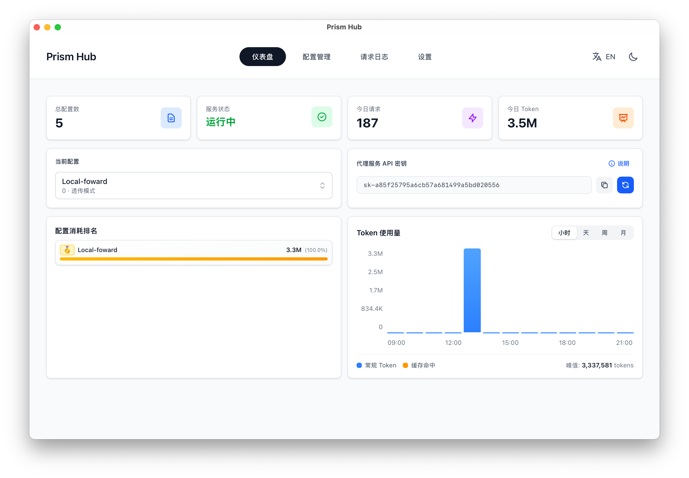
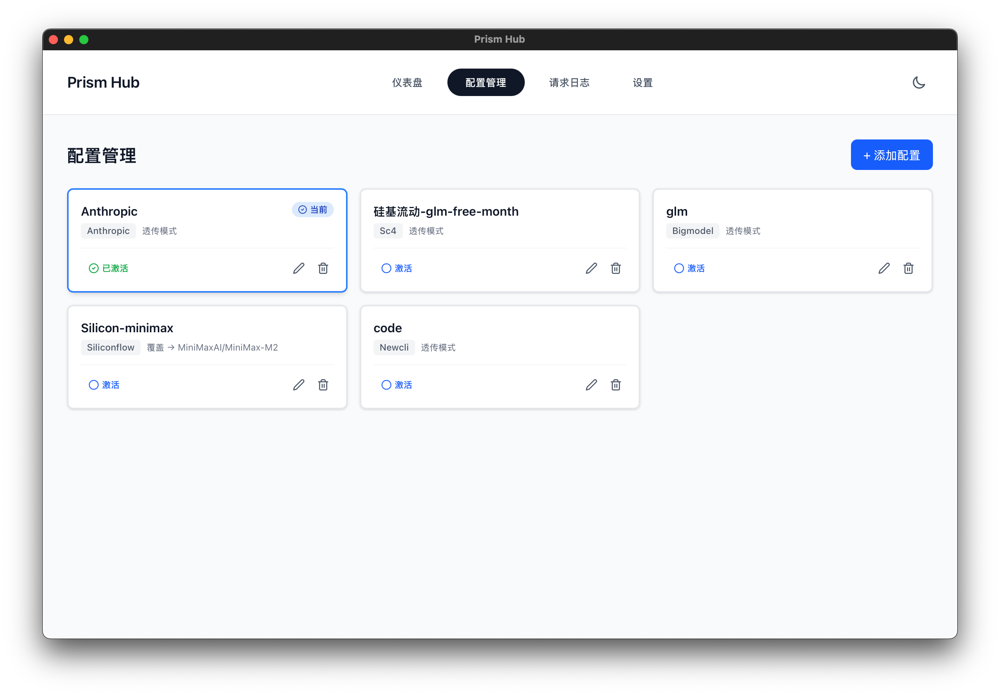
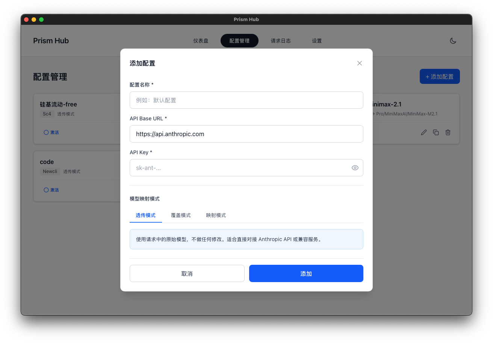

# Prism ｜ Claude Code Proxy Hub

<div align="center">

专为 Claude Code 打造的智能路由网关与流量审计工具

**无需重启 Claude Code 一键切换模型**

实现"一次配置，随意切换"的无缝体验，提供完整的流量去向记录与成本审计

</div>

---

## 项目简介



Prism Hub 是一个专为 Claude Code 设计的本地代理工具，解决多 API 提供商管理、模型兼容性、流量审计等核心问题。

### 核心特性

**无需重启即时切换**
- 菜单栏一键切换供应商，无需重启 Claude Code 窗口
- 传统方式需要修改环境变量并重启窗口（耗时 30+ 秒），Proxy Hub 只需 1 秒

**智能模型映射**
- 自动将标准模型名称（如 `claude-sonnet-4-5`）映射到不同提供商的实际模型 ID
- 支持 Anthropic 官方 API、OpenRouter、第三方代理等多种模式

**完整流量审计**
- 记录每个请求的 Token 消耗（Input/Output/Total）
- 追踪请求耗时、HTTP 状态码、路由去向
- 提供成本估算和统计分析

**本地优先与安全**
- 所有数据仅在本地处理，API Key 使用 AES 加密存储
- 界面默认脱敏展示，确保敏感信息安全

---

## 界面预览

### 仪表盘


实时显示当前激活配置、统计数据和关键指标。

### 配置管理


统一管理多个 API 提供商配置，支持快速切换。

### 添加配置


向导式配置流程，支持测试连接验证。

---

## 快速开始

### 系统要求

- macOS 10.15 或更高版本
- 已安装 Claude Code CLI

### 安装

#### 方式一：下载预编译版本（推荐）

1. 前往 [Releases](https://github.com/yourusername/prism/releases) 页面
2. 下载最新版本的 `.dmg` 文件
3. 双击安装，拖拽到 Applications 文件夹
4. 首次打开可能需要在"系统偏好设置 > 安全性与隐私"中允许运行

#### 方式二：从源码构建

```bash
# 克隆仓库
git clone https://github.com/yourusername/prism.git
cd prism

# 安装依赖
pnpm install

# 开发模式运行
pnpm tauri dev

# 构建生产版本
pnpm tauri build
```

### 配置 Claude Code

**只需配置一次，之后无需修改任何环境变量**

1. 启动 Claude Code Proxy Hub，默认监听 `http://localhost:3000`

2. 配置 Claude Code 使用本地代理：

```bash
# 在 ~/.zshrc 或 ~/.bashrc 中添加（只需一次）
export ANTHROPIC_API_URL=http://localhost:3000
export ANTHROPIC_API_KEY=placeholder  # 占位符，实际 Key 在 Proxy Hub 中配置
```

3. 在 Proxy Hub 中添加你的 API 配置

   **官方 API**
   - API Base URL: `https://api.anthropic.com`
   - API Key: `sk-ant-xxxxx`
   - 模型映射: `claude-sonnet-4-5` → `claude-sonnet-4-20250514`

   **OpenRouter**
   - API Base URL: `https://openrouter.ai/api/v1`
   - API Key: `sk-or-xxxxx`
   - 模型映射: `claude-sonnet-4-5` → `anthropic/claude-sonnet-4-5`

   **第三方代理**
   - API Base URL: `https://your-proxy.com/v1`
   - API Key: `custom-xxxxx`
   - 模型映射: `claude-sonnet-4-5` → `claude-3-5-sonnet-20241022`

4. 在菜单栏选择要使用的配置，无需重启 Claude Code，立即生效

---

## 文档导航

- [使用指南](docs/使用指南.md) - 详细的三种配置模式和使用方法
- [技术架构](docs/技术架构.md) - 技术栈、架构设计和核心模块
- [开发文档](docs/开发文档.md) - 项目结构、开发环境和构建指南
- [常见问题](docs/常见问题.md) - FAQ 和故障排查
- [路线图](docs/路线图.md) - 已完成功能、开发中功能和未来计划

---

## 对比

| 特性 | 传统方式 | Proxy Hub |
|------|---------|-----------|
| 切换供应商 | 修改环境变量 + 重启窗口 | 菜单栏一键切换 |
| 模型兼容 | 手动修改模型 ID | 自动映射转换 |
| Token 统计 | 无记录 | 完整追踪 |
| 成本审计 | 估算困难 | 精确计算 |
| 请求日志 | Claude Code 不提供 | 完整记录 |
| 配置管理 | 分散在多个文件 | 统一管理 |
| API Key 安全 | 明文存储 | 加密存储 |

---

## 许可证

本项目采用 [CC BY-NC 4.0](LICENSE) 协议开源。

**仅供个人使用，禁止商业使用。**

如需商业使用，请联系作者获取授权。

---

## 致谢

- [Tauri](https://tauri.app/) - 优秀的桌面应用框架
- [Claude](https://claude.ai/) - 强大的 AI 助手
- [Anthropic](https://www.anthropic.com/) - Claude API 提供商

---

## 联系方式

- 问题反馈：[GitHub Issues](https://github.com/yourusername/prism/issues)
- 功能建议：[GitHub Discussions](https://github.com/yourusername/prism/discussions)

---

<div align="center">

**如果这个项目对你有帮助，请给个 Star 支持一下！**

Made with heart for Claude Code users

</div>
